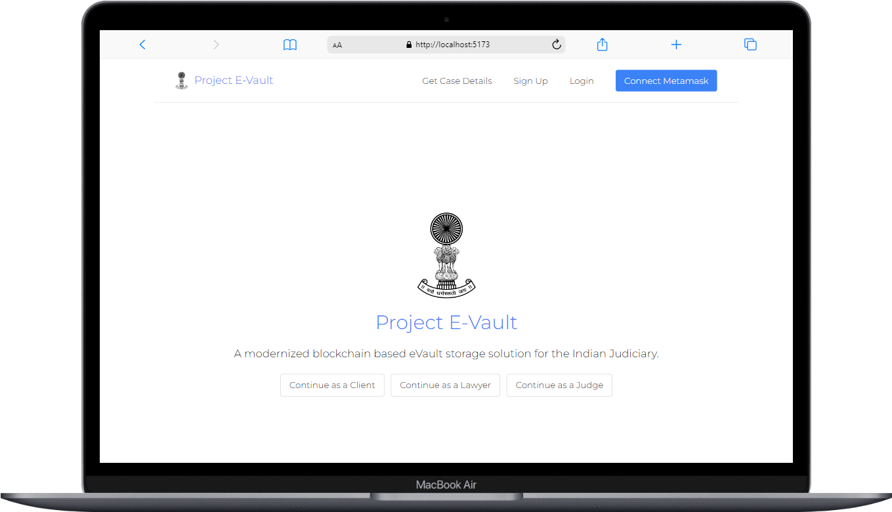
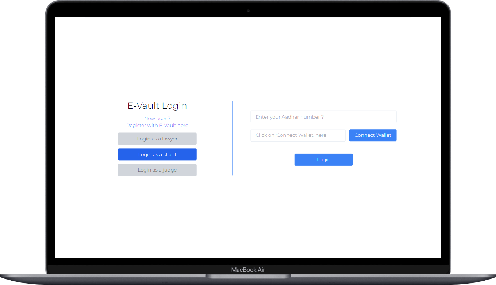
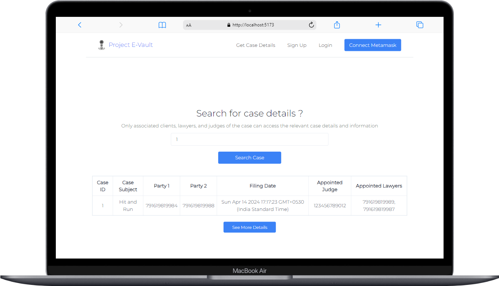
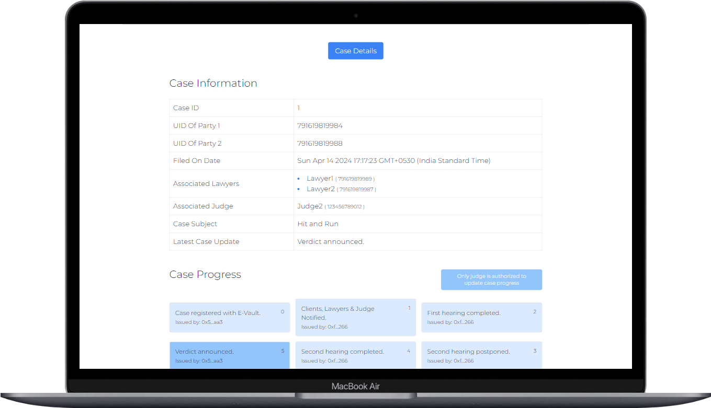

<h2>Project E-Vault (EVM Based)</h2>

<h4><b>Description: A modernized blockchain(EVM) based eVault storage solution for the Indian Judiciary made using ViteJS.</b></h4>

<h4><b>Theme: Law and Justice | Open Innovation</b></h4>

<h4><b>Track: Web3 - Blockchain | Web3/Ethereum Track | Web Development</b></h4>

<h3><b>Snapshots from the project :</b></h3>

Currently, the app can be tested on <b>Localhost (Hardhat)</b> & <b>Sepolia (EVM)</b> test network using Alchemy endpoint.

<h3><b>E-Vault Features :</b></h3>

<ul>
    <li>Registering clients</li>
    <li>Registering lawyers</li>
    <li>Registering judges</li>
    <li>Registering legal cases</li>
    <li>Login system for clients, lawyers & judges using Aadhar UID</li>
    <li>Updating case progress by allocated judges</li>
    <li>Automatic / Random allocation of judges</li>
    <li>Uploading case documents to IPFS & keeping case records by chosen case lawyers</li>
    <li>Fetching basic case information using caseIDs by public</li>
    <li>Metamask wallet integration and usage for access authorization</li>
</ul>

<h3><b>Tech Stack :</b></h3>

<b>Frontend :</b>

<ul>
    <li>Vite JS</li>
    <li>Tailwind CSS</li>
    <li>React Toastify</li>
    <li>React Charts</li>
    <li>Shadcn UI</li>
</ul>

<b>Backend :</b>

<ul>
    <li>Node JS</li>
    <li>Hardhat Development Environment</li>
    <li>Metamask Wallet</li>
    <li>Ethers JS</li>
    <li>Alchemy</li>
    <li><a href="https://www.pinata.cloud/">Pinata IPFS</a></li>
</ul>

<h3><b>Guide for testing on local hardhat network :</b></h3>

<b>Environment variables :</b>

<ul>
    <li>Create a new .env file inside [blockchain-hardhat] folder taking reference from .env.example file inside the same.</li>
</ul>

<b>Backend :</b>

Terminal 1:

<ul>
    <li>Run (Move inside [blockchain-hardhat] folder): <b>cd blockchain-hardhat</b></li>
    <li>[ONLY ONCE] Run (Package installations): <b>npm install</b></li>
    <li>Run (Running Hardhat node locally): <b>npx hardhat node</b></li>
</ul>

Terminal 2:

<ul>
    <li>Run (Move inside [blockchain-hardhat] folder): <b>cd blockchain-hardhat</b></li>
    <li>[OPTIONAL] Run (Running tests): <b>npx hardhat test</b></li>
    <li>Run (Running deployment script for <b>Localhost</b>): <b>npx hardhat run scripts/deploy_fetchCaseDetailsByAClient.js --network localhost</b></li>
    <li>[OPTIONAL -> ONLY FOR SEPOLIA] Run (Running deployment script for <b>Sepolia</b>): <b>npx hardhat run scripts/deploy_fetchCaseDetailsByAClient.js --network sepolia</b></li>
</ul>

Update the <b>[backend-config.json]</b> file inside /frontend-vite with the updated contract-address under <b>"31337"</b> "address" feild fetched from Terminal 2.

[OPTIONAL -> ONLY FOR SEPOLIA] Update the <b>[backend-config.json]</b> file inside /frontend-vite with the updated contract-address under <b>"11155111"</b> "address" feild fetched from Terminal 2.

<b>Frontend :</b>

Terminal 1:

<ul>
    <li>Run (Move inside [frontend-vite] folder): <b>cd frontend-vite</b></li>
    <li>[ONLY ONCE] Run (Package installations): <b>npm install</b></li>
    <li>Run (Running frontend on localhost:5173): <b>npm run dev</b></li>
</ul>

<h3><b>Libraries and dependencies :</b></h3>

<h4><b>Production Dependencies :</b></h4>

- [@radix-ui/react-dialog](https://www.npmjs.com/package/@radix-ui/react-dialog) (^1.0.5)
- [class-variance-authority](https://www.npmjs.com/package/class-variance-authority) (^0.7.0)
- [clsx](https://www.npmjs.com/package/clsx) (^2.1.0)
- [lucide-react](https://www.npmjs.com/package/lucide-react) (^0.364.0)
- [react](https://www.npmjs.com/package/react) (^18.2.0)
- [react-datepicker](https://www.npmjs.com/package/react-datepicker) (^4.17.0)
- [react-dom](https://www.npmjs.com/package/react-dom) (^18.2.0)
- [react-router-dom](https://www.npmjs.com/package/react-router-dom) (^6.22.0)
- [react-toastify](https://www.npmjs.com/package/react-toastify) (^10.0.5)
- [recharts](https://www.npmjs.com/package/recharts) (^2.12.3)
- [tailwind-merge](https://www.npmjs.com/package/tailwind-merge) (^2.2.2)
- [tailwindcss-animate](https://www.npmjs.com/package/tailwindcss-animate) (^1.0.7)
- [dotenv](https://www.npmjs.com/package/dotenv) (^14.2.0)

<h4><b>Development Dependencies :</b></h4>

- [@nomiclabs/hardhat-ethers](https://www.npmjs.com/package/@nomiclabs/hardhat-ethers) (^2.0.4)
- [@nomiclabs/hardhat-etherscan](https://www.npmjs.com/package/@nomiclabs/hardhat-etherscan) (^3.0.0)
- [@nomiclabs/hardhat-waffle](https://www.npmjs.com/package/@nomiclabs/hardhat-waffle) (^2.0.2)
- [chai](https://www.npmjs.com/package/chai) (^4.3.4)
- [ethereum-waffle](https://www.npmjs.com/package/ethereum-waffle) (^3.4.0)
- [ethers](https://www.npmjs.com/package/ethers) (^5.5.3)
- [hardhat](https://www.npmjs.com/package/hardhat) (^2.8.3)
- [hardhat-gas-reporter](https://www.npmjs.com/package/hardhat-gas-reporter) (^1.0.7)
- [solidity-coverage](https://www.npmjs.com/package/solidity-coverage) (^0.7.18)
- [@types/react](https://www.npmjs.com/package/@types/react) (^18.2.15)
- [@types/react-dom](https://www.npmjs.com/package/@types/react-dom) (^18.2.7)
- [@vitejs/plugin-react](https://www.npmjs.com/package/@vitejs/plugin-react) (^4.0.3)
- [autoprefixer](https://www.npmjs.com/package/autoprefixer) (^10.4.15)
- [eslint](https://www.npmjs.com/package/eslint) (^8.45.0)
- [eslint-plugin-react](https://www.npmjs.com/package/eslint-plugin-react) (^7.32.2)
- [eslint-plugin-react-hooks](https://www.npmjs.com/package/eslint-plugin-react-hooks) (^4.6.0)
- [eslint-plugin-react-refresh](https://www.npmjs.com/package/eslint-plugin-react-refresh) (^0.4.3)
- [postcss](https://www.npmjs.com/package/postcss) (^8.4.29)
- [tailwindcss](https://www.npmjs.com/package/tailwindcss) (^3.3.3)
- [vite](https://www.npmjs.com/package/vite) (^4.4.5)

<h3><b>Overview video:</b></h3>

https://www.loom.com/share/a5b5990273df4629b7dc2af6bbf9d08d?sid=3962bd00-ebff-4a92-9811-d50956a3c7e8

<h3><b>Pitch deck:</b></h3>

<b>The project is complete but I'm open to suggestions & modifications for this project. Please don't forget to put a ⭐ if you like the project.</b>
